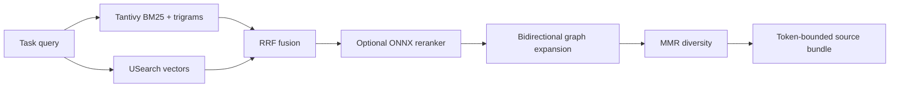

# Findex

Findex is a local, model-agnostic codebase intelligence engine written in Rust. It combines exact AST/symbol locations, cross-file structure, lexical and vector retrieval, token-bounded context assembly, MCP, an advanced terminal UI, and a lightweight Tauri desktop explorer.

Its differentiator from editor search is the retrieval product: Findex does not just find text. It ranks definitions and chunks, expands their dependency neighborhood, removes redundant context, and returns exact source ranges under a caller-specified token budget.

## Implemented in Wave 3

- Hierarchical, persisted BLAKE3 Merkle snapshots. Recursive comparison stops at equal directory hashes and reports only changed/deleted leaves; discovery still hashes supported files for correctness. Generated dependency/build/index trees are pruned even without a `.gitignore` to prevent accidental CPU/RAM blowups.
- Stack Graph resolution enabled by default for Python, JavaScript, TypeScript/TSX, and Java using published TSG packages. Exact cross-file `References` edges are tagged separately; other languages retain the heuristic resolver.
- Source-accurate Vue SFC parsing. `<script>` uses Oxc, CSS `<style>` uses tree-sitter, template component tags produce reference edges, and all virtual block ranges map back to the `.vue` file.
- MCP `2025-11-25` task-augmented tool calls with persistent task records, TTL bounds, concurrency limits, `tasks/get`, `tasks/result`, `tasks/list`, and `tasks/cancel`.
- MCP Streamable HTTP JSON POST transport at `/mcp`, with protocol-version checks, Origin validation, loopback binding by default, and bearer authentication required for non-loopback binds.
- Agent-focused MCP products: token-bounded context bundles, impact analysis, AST outlines, graph snapshots, and runtime resource profiles.
- Major-language indexing now covers JavaScript/TypeScript/JSX/TSX, Vue, Rust, Python, HTML/CSS, Dart, C/C++, Go, Java, C#, Ruby, PHP, and Swift. OOP contracts, inheritance, constructors, methods, modules/namespaces, traits/mixins/protocols, records, extensions, and enum variants are normalized into the shared graph model.
- Structural prefetch is hop/fan-out/work-set bounded; context bundles combine retrieval anchors with graph-local neighbors and include an auditable selection reason. Token graph pruning preserves explicit seeds and skips oversized distractions instead of terminating the search.
- The session VFS stores shared `Arc<str>` content under byte/file caps with LRU eviction, versioned BLAKE3 hashes, and isolated micro-compilation. Semantic diffs switch to linear-memory keyed alignment for wide ASTs and cap reported source payloads. Trace/taint propagation reads adjacency on demand and pins accumulated evidence tags.
- A six-view terminal interface with GitHub-light/Nord-dark themes: dashboard, debounced hybrid search, an interactive typed-edge graph with 0-4 hop focus/pan/zoom/fit/pinning, manual graph query, impact inspector, and live runtime/GPU policy. Nerd Font glyphs have an ASCII fallback and motion can be disabled.
- A React/Tauri desktop app with an embedded token-protected Axum API, lazy-loaded WebGL/Three.js graph, search, AST, graph query, impact, runtime, and persisted settings views. Its restrained light/dark/system visual tokens follow GitHub Primer rather than glass/gradient styling.
- Three immutable ONNX model profiles: `fast` keeps the MiniLM pair for CPU latency, `balanced` uses quantized code-specialized Jina models, and `quality` uses their full-precision artifacts. Changing model, embedding window, dimension, or vector scalar format automatically invalidates the incompatible vector graph.
- Signed background update checks for long-running CLI/TUI hosts and Tauri. Installation is never silent: CLI, TUI, and desktop require user consent, then verify the release signature before replacement.
- One Tauri platform installer contains the desktop executable and the release `findex` sidecar, so the same install adds CLI commands and `findex tui`; Windows packages also maintain the user PATH on install/uninstall.
- Optional stages are runtime gates, not build variants. Index-local settings control lexical/semantic indexing, reranking, graph expansion, structural prefetch, Stack Graphs, watchers, VFS/trace pinning, graph limits, model/device/memory policy, and UI appearance across CLI, TUI, desktop, and MCP.

## Retrieval pipeline



The hot path is pure Rust. Rayon bounds CPU parallelism, memmap2 avoids copies during parsing, model sessions are reused, vector builds are batched, and GPU probing is excluded from search/index hot paths. CUDA is optional and used only for ONNX inference.

## Quick start

```powershell
cargo test --workspace
cargo run -p findex-cli -- models
cargo run -p findex-cli -- models --profile balanced
cargo run -p findex-cli -- index .
cargo run -p findex-cli -- search "incremental indexing" --mode hybrid
cargo run -p findex-cli -- context "change MCP task cancellation" --tokens 2048 --format json
cargo run -p findex-cli -- tui
```

Useful human and agent commands:

```powershell
findex status --format json
findex settings show --format json
findex settings set --graph-hops 1 --candidates 32 --compute auto
findex doctor --format json
findex models --offline --format json
findex update check
findex impact "exact-symbol-id" --format json
findex ast crates/findex-core/src/lib.rs --format json
findex graph-export --limit 1000 > graph.json
findex mcp
findex mcp-http --bind 127.0.0.1:37420
```

For HTTP, set `FINDEX_MCP_TOKEN` before binding beyond loopback. The current server is stateless JSON Streamable HTTP: POST is implemented, while GET/SSE resumability and MCP session IDs are intentionally not advertised.

## MCP tools that save agent work

| Tool | Why it exists |
|---|---|
| `get_context_bundle` | One token-bounded repo map plus ranked exact source ranges, replacing repeated search/read loops. |
| `impact_analysis` | Fan-in/out, callers, callees, references, affected files, and God-node risk before an edit. |
| `get_ast_outline` | Nested symbol/AST view, including the script/style/template structure indexed from Vue SFCs. |
| `get_graph_snapshot` | Bounded degree-ranked graph classified as God/UI/API/code for planning and visualization. |
| `get_runtime_profile` | CPU/RAM/GPU, process RSS, memory budget, quantization, and recommended embedding batch. |
| `get_architecture_overview` | Source-free language/layer/contract/entrypoint/hub digest for first-pass repository orientation. |
| `get_settings`, `set_setting` | Inspect optional stages and change one user-authorized runtime policy without replacing the build or resetting unrelated controls. |
| `prune_context` | Structural subgraph under a strict token budget; explicit task anchors are retained. |
| `vfs_update`, `micro_compile` | Bounded unsaved-file shadowing and isolated parse/relationship validation without touching disk or the persisted index. |
| `pin_execution_trace` | Attach validated runtime paths to graph adjacency while preserving multiple trace identities. |
| `search_code` | Hybrid/lexical/semantic search with exact paths and line ranges. |
| `repo_map` | Personalized PageRank signature skeleton under a token budget. |
| `expand_context` | Bounded structural neighborhood around an exact symbol. |
| `semantic_diff`, `taint_trace`, `predict_context` | Structural change, review leads, and graph-local context prediction. |

Long tools declaring `execution.taskSupport: optional` can be invoked with a normal task-augmented `tools/call`:

```json
{
  "method": "tools/call",
  "params": {
    "name": "reindex",
    "arguments": { "root": "." },
    "task": { "ttl": 300000 }
  }
}
```

There is no `tasks/create` method in MCP `2025-11-25`; tasks augment the original request. Cancellation is terminal and prevents a late result from replacing the cancelled state. Existing CPU-bound library operations are not forcibly pre-empted mid-call yet.

## Desktop UI

```powershell
cd crates/findex-tauri
npm install
npm run build
npm run build:installer:unsigned
cd ../..
cargo run -p findex-tauri
```

The unsigned command is a local Windows packaging smoke test. Release CI builds signed updater artifacts from `tauri.updater.conf.json`. Each platform bundle includes the release CLI/TUI sidecar. The frontend production build code-splits Three.js: the normal UI bundle loads first and the 3D graph chunk is fetched only for the graph surface. The local Axum data API first tries `127.0.0.1:37421`, falls back to an ephemeral loopback port if occupied, and uses a random per-process token delivered to the WebView through a Tauri command.

Packaged desktop releases check the signed GitHub `latest.json` after startup without blocking the UI. A compact banner opens a release-details dialog; download and installation begin only after the user selects **Install update**. CLI/TUI releases use the same public trust root with `latest-cli.json`; use `findex update check`, `findex update install`, or F8 in the TUI. Local developer builds have no compiled public key and remain network-silent.

## Model profiles

| Profile | Embedding | Reranker | Use when |
|---|---|---|---|
| `fast` (default) | `all-MiniLM-L6-v2`, 384d | `ms-marco-MiniLM-L6-v2` | CPU-first interactive work and the lowest storage/latency. |
| `balanced` | quantized `jina-embeddings-v2-base-code`, 768d | quantized `jina-reranker-v1-turbo-en` | Code retrieval accuracy matters and a larger one-time vector build is acceptable. |
| `quality` | full-precision Jina code model | full-precision Jina reranker | Evaluation/offline use with more RAM, disk, and inference time. |

The MiniLM models remain good speed baselines, but the embedder is general-purpose, truncates at a short window, and is not trained specifically for code. The balanced embedding model covers 30 programming languages and an 8K model context; the balanced reranker is a 37.8M-parameter 6-layer cross-encoder with an 8K model context. Findex still bounds actual windows and rerank depth because feeding maximum context to every candidate hurts latency. Model-card benchmark gains are not treated as Findex gains: run a repository-specific relevance set before promoting a profile.

Production hosts are cache-first and non-blocking: when a pinned model is missing, a named background worker acquires it while deterministic dimension-compatible retrieval remains available, then atomically swaps in the verified ONNX component. An embedding fingerprint change triggers a vector-index rebuild before old and new vectors can mix.

## Runtime settings

Settings live beside the project index and are shared by every interface:

```powershell
findex settings show
findex settings set --lexical true --semantic true --reranking true
findex settings set --graph-expansion true --structural-prefetch true --graph-hops 1
findex settings set --model-profile balanced --compute auto --memory-mib 2048 --gpu-memory-mib 4096
```

The MCP equivalents are `get_settings` and the single-key `set_setting`. Search responses and context bundles report the effective retrieval path, so a disabled semantic or lexical leg cannot silently masquerade as hybrid retrieval. If both legs are disabled, search returns an explicit configuration error while graph/navigation/AST tools remain usable.

`CodeRankEmbed` is a credible code-specialized alternative with an 8K context and strong author-reported CodeSearchNet/CoIR results, but its official repository currently does not ship an ONNX artifact. It remains an override/evaluation candidate rather than forcing conversion risk into the default installer. Moving from the 6-layer to the 12-layer MS MARCO MiniLM reranker is not useful here: the published MS MARCO table reports effectively identical ranking quality with much lower throughput for the 12-layer variant.

## Resource controls

| Variable | Default | Purpose |
|---|---:|---|
| `FINDEX_RAYON_THREADS` | logical CPUs minus 2, max 26 | Leaves capacity for the UI and async transports. |
| `FINDEX_MEMORY_BUDGET_MB` | 25% of RAM, max 2048 MiB | Runtime policy target shown in CLI/TUI/UI. |
| `FINDEX_EMBEDDING_BATCH` | adaptive | Explicit override for resource-derived embedding batch guidance. |
| `FINDEX_EMBEDDING_MAX_TOKENS` | fast: `256`; Jina: `512` | Bounded model sequence length. |
| `FINDEX_MODEL_PROFILE` | `fast` | `fast`, `balanced`, or `quality`; changing it triggers a compatible vector rebuild. |
| `FINDEX_MODEL_POLICY` | release: `auto`; debug/test: `disabled` | `auto` downloads immutable model revisions into the shared Hugging Face cache; `offline` requires cached files; `disabled` uses deterministic fallbacks. |
| `FINDEX_RERANK_MAX_TOKENS` | `384` | Maximum query/candidate sequence; batches use only the longest actual sequence below this cap. |
| `FINDEX_RERANK_CANDIDATES` | profile-aware | Stage-two depth (`24` fast, `16` balanced, `12` quality). |
| `FINDEX_RERANK_BATCH_SIZE` | `16` | Maximum cross-encoder batch; lower it when CPU cache or VRAM is constrained. |
| `FINDEX_ONNX_THREADS` | bounded by CPU policy | Intra-op threads for each ONNX model session; inter-op work stays at one thread. |
| `FINDEX_ONNX_DEVICE` | `auto` | `auto`, `cpu`, or `cuda`; CUDA requires the feature, provider, driver, and compatible libraries and otherwise falls back to CPU. |
| `FINDEX_CUDA_DEVICE_ID` | `0` | CUDA device ordinal. |
| `FINDEX_GPU_MEMORY_LIMIT_MB` | adaptive, max 4096 MiB | ONNX CUDA arena cap; does not cap every CUDA allocation. |
| `FINDEX_MODEL_IDLE_SECS` | `300` | Release idle embedding/reranker sessions; `0` disables eviction. Sessions reload lazily. |
| `FINDEX_VECTOR_QUANTIZATION` | `bf16` | USearch scalar storage (`bf16`, `i8`, or `b1`). Profile/window/scalar changes rebuild incompatible vectors. |
| `FINDEX_STACK_GRAPH_MAX_FILES` | `2000` | Prevents unbounded global Stack Graph work. |
| `FINDEX_STACK_GRAPH_FILE_TIMEOUT_MS` | `400` | Per-file graph construction bound. |
| `FINDEX_STACK_GRAPH_QUERY_TIMEOUT_MS` | `2000` | Global path-stitching bound; partial exact edges are retained on timeout. |
| `FINDEX_INCLUDE_GENERATED` | `0` | Set `1` only when `node_modules`, `target`, virtual environments, build output, or Findex's own index should be indexed intentionally. |
| `FINDEX_MAX_CONCURRENT_TASKS` | `4` | MCP task concurrency cap. |
| `FINDEX_TUI_MOTION` | `1` | Set `0` for reduced motion. |
| `FINDEX_TUI_ICONS` | `nerd` | Set `ascii` when Nerd Font glyphs are unavailable. |
| `FINDEX_VFS_MAX_MB` | `64` | Per-MCP-process VFS shadow-content cap. |
| `FINDEX_VFS_MAX_FILES` | `512` | Maximum shadowed files before LRU eviction. |
| `FINDEX_VFS_PERSIST` | `0` | Opt in to persisting unsaved VFS content in the project database. |

## Standards and honest boundaries

Findex targets MCP [`2025-11-25`](https://modelcontextprotocol.io/specification/2025-11-25/basic/lifecycle). Tasks remain experimental in that specification. The HTTP transport follows the current [transport requirements](https://modelcontextprotocol.io/specification/2025-11-25/basic/transports), including local binding and Origin validation. [SKILL.md](SKILL.md) follows the current [Agent Skills specification](https://agentskills.io/specification).

The primary store remains sled behind the `Storage` abstraction; a backend migration needs a separately versioned compatibility and rollback wave. USearch scalar formats are not TurboQuant. Actual TurboQuant requires rotation, calibration, and recall benchmarks and remains a future backend.

Stack Graph exact cross-file resolution remains limited to its shipped Python, JavaScript/TypeScript/TSX, and Java TSG packages; other indexed languages use AST edges plus heuristic resolution. Kotlin is not enabled because the available grammar dependency is ABI-incompatible with the tree-sitter/Stack Graph version currently pinned. Semantic diff is a bounded ordered approximation, not an exact Zhang-Shasha or GumTree implementation. VFS state is process-local by default; optional persistence is explicit because it writes unsaved source into the project index. CUDA accelerates compatible ONNX embedding and reranking sessions only; parsing, hashing, graph construction, lexical search, and vector lookup remain CPU work.

## Verification

```powershell
cargo fmt --all -- --check
cargo test --workspace
cargo clippy --workspace --all-targets -- -D warnings
Push-Location crates/findex-tauri; npm run build; npm run build:installer:unsigned; Pop-Location
python $HOME/.codex/skills/.system/skill-creator/scripts/quick_validate.py .
```

See [IMPLEMENTATION_STATUS.md](IMPLEMENTATION_STATUS.md) for exact plan coverage, [COMPETITIVE_EDGE_ROADMAP.md](COMPETITIVE_EDGE_ROADMAP.md) for benchmark-gated next advantages, [plan.md](plan.md) for the project constitution, and [architecture.md](architecture.md) for the research architecture.
